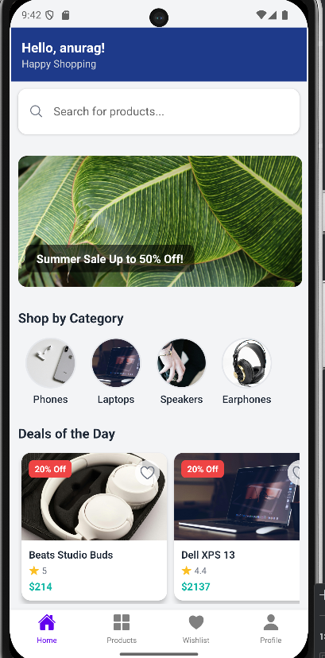
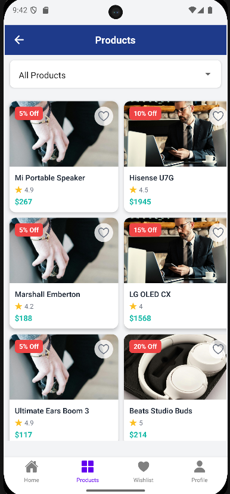
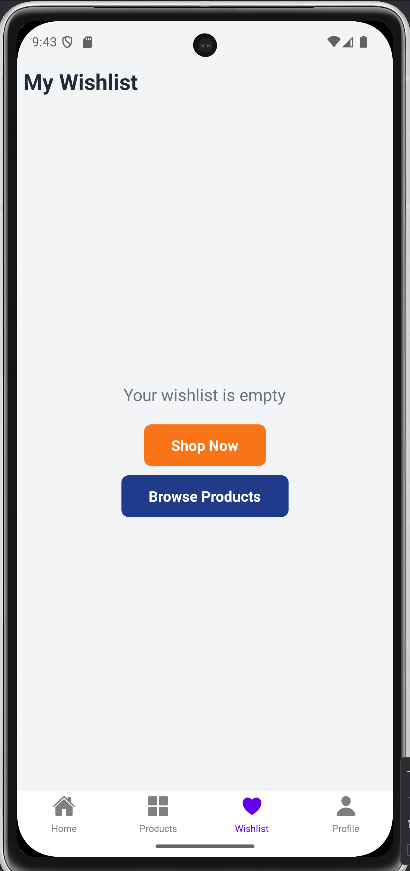
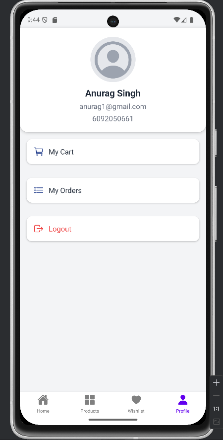
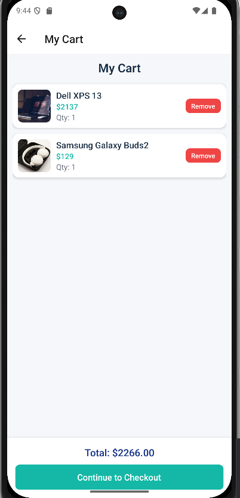

Team Members-
Komal S Popli
Anurag Singh
 
 Design and Purpose
 Our shopping app is designed for tech-savvy users who frequently shop for electronics like phones, laptops, and accessories. The app provides an intuitive interface, categorized product browsing, wishlist management, product search mechanism and seamless navigation. It’s targeted at mobile-first users seeking a clean, efficient shopping experience with quick access to product deals.

 Screenshots
 Home Screen-

 

 Product Screen-

 

 Wishlist Screen-

Profile Screen-

My cart Screen-

Home Screen: Displays categories, banners, and deal-of-the-day highlights.
Product Detail Screen: Shows product info, rating, price, and wishlist toggle.
Wishlist Screen: Displays user-saved items; includes "Shop Now" action if empty.

Server API Design and Specification

Firebase Firestore & Authentication were used for backend services.
Endpoints and Operations
/products

Method: GET

Purpose: Fetch a list of all available products

Parameters: None

Implementation: Queried using Firebase getDocs(collection(db, 'products'))

/wishlists/:uid

Method: GET

Purpose: Retrieve the wishlist items for a specific user

Parameters: Firebase Auth UID

Implementation: Read the document wishlists/{uid} from Firestore.

/cart/:uid
Method: PUT
Purpose: Add/Update/Remove item in cart
Data: JSON with { productId, quantity, ... }
Implementation: Update the items array in cart/{uid}

/wishlists/:uid

Method: PUT

Purpose: Add or remove a product from the user's wishlist

Data: JSON object with the product structure like { id, name, price, image, ... }

Implementation: Update the items field inside the wishlists/{uid} Firestore document.

Example API Flow:

On app load, the app uses Firebase Auth to retrieve the user's ID.
Cart:

When a user adds an item to the cart, the product is stored in cart/{uid} as part of a document with a items array.

The quantity can be updated, and the entire cart can be fetched via getDoc(doc(db, 'cart', uid)).

Orders:

Upon checkout, the cart data is used to create a document in orders/{uid}/user_orders/{orderId}.

Each order contains cart items, order total, timestamp, and optionally shipping info

Experiences

This project was an end-to-end mobile app built with React Native (Expo), Firebase Authentication, and Firestore. 

Key experiences included:
Firebase Integration: We replaced local state with real-time Firestore sync for wishlist storage.
UI Design: Crafted a modern UI with categorized cards, horizontal lists, and responsive layout.
Wishlist Toggle Logic: Built a context-based solution for managing global wishlist state.
Challenges: Syncing state after login, handling async Firestore operations, and styling scrollable lists.
Best Practices: Code modularity, context providers, reusable components (ProductCard, CategoryCard), and loader handling using ShimmerPlaceholder.
Future Plans: Add Stripe checkout, user reviews, and category-based filtering with Firebase queries.
